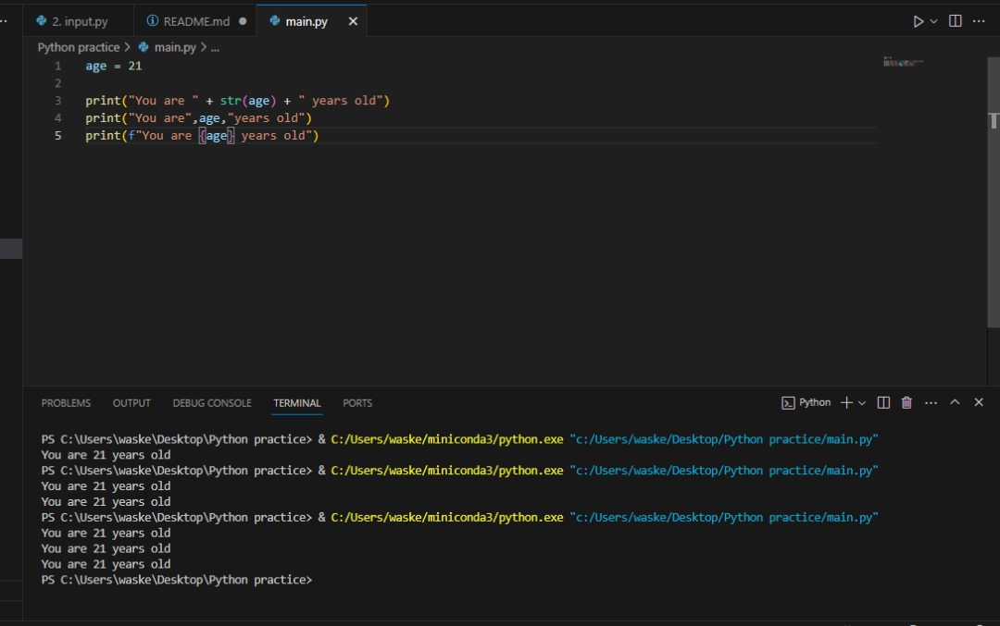
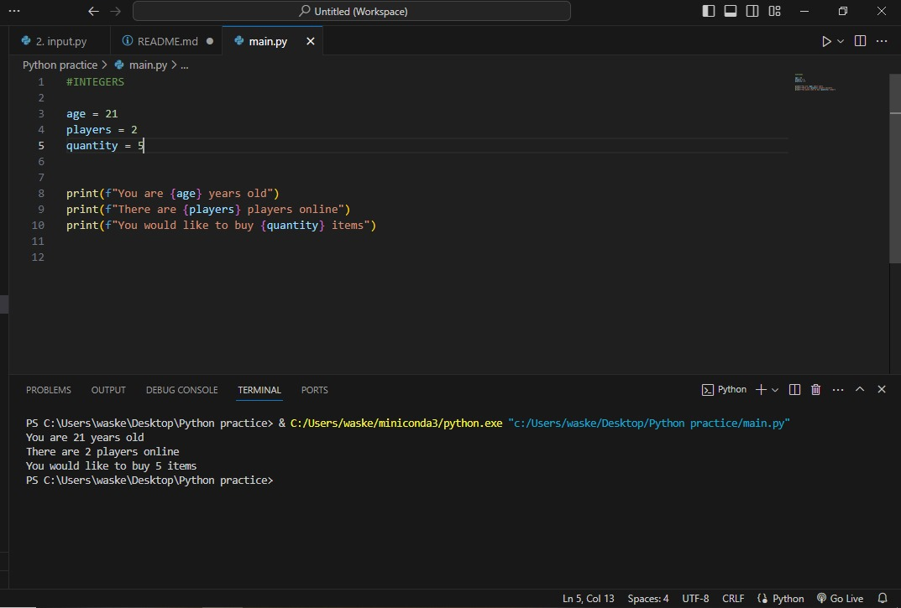
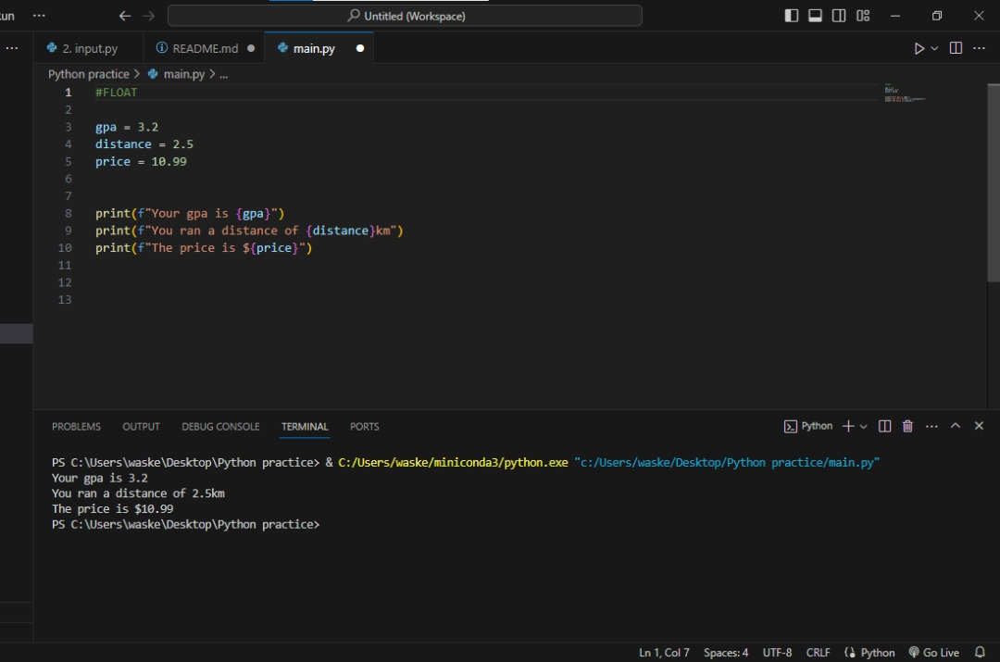
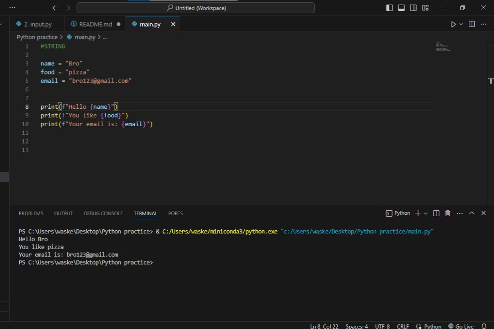
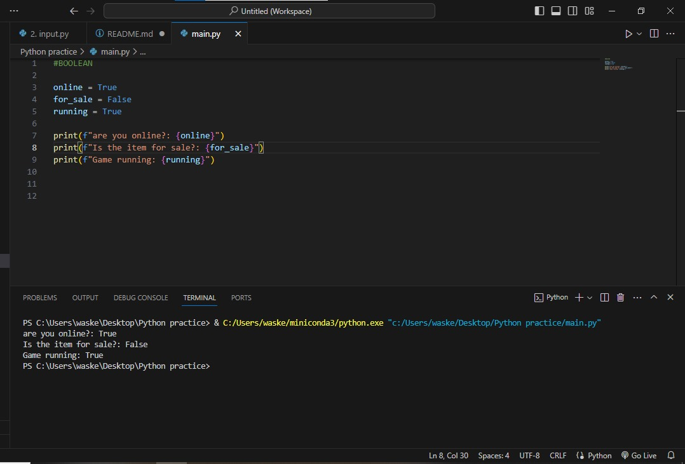
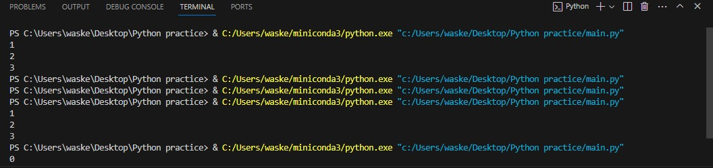
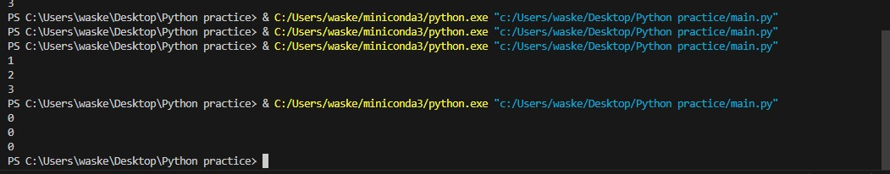

# Mastering Python


# Project

# Variables

## What are variables?
A reusable container for storing a value
 
A variable behaves as if it were the value it contains

## Variable Command
The following are examples of how variables can be displayed along with a text
 

```
If the variable is age and age = 21
Using string, print("You are " + str(age) + " years old")
By seperating the text and variabke in two separate arguement ("You are",age,"years old")
Using the f command, print(f"You are {age} years old")

```


# TYPES OF DATA TYPES
There are four types of data types

## 1. Integers
Integers are whole numbers

age = 21

players = 2

quantity = 5

```
print(f"You are {age} years old")
print(f"There are {players} players online")
print(f"You would like to buy {quantity} items")
```



## 2. Float
They are numbers that contains decimal portions

gpa = 3.2

distance = 2.5

price = 10.99

```
print(f"Your gpa is {gpa}")
print(f"You ran a distance of {distance}km")
print(f"The price is ${price}")
```


## 3. String
They are just a series of text or characters

name = "Bro"

food = "pizza"

email = "bro123@gmail.com"

```
print(f"Hello {name}")
print(f"You like {food}")
print(f"Your email is: {email}")
```


## 4. Float
This is a binary which is either true or false

online = True

for_sale = False

running = True
```
print(f"are you online?: {online}")
print(f"Is the item for sale?: {for_sale}")
print(f"Game running: {running}")
```


## More on Variables

 
x = 1

y = 2

z = 3
```
print(x)

print(y)

print(z)
```

multiple assignment

x, y, z = 1, 2, 3
```
print(x)

print(y)

print(z)
```
set multiple variable to the same value

x = y = z = 0

```
print(x)

print(y)

print(z)
```


